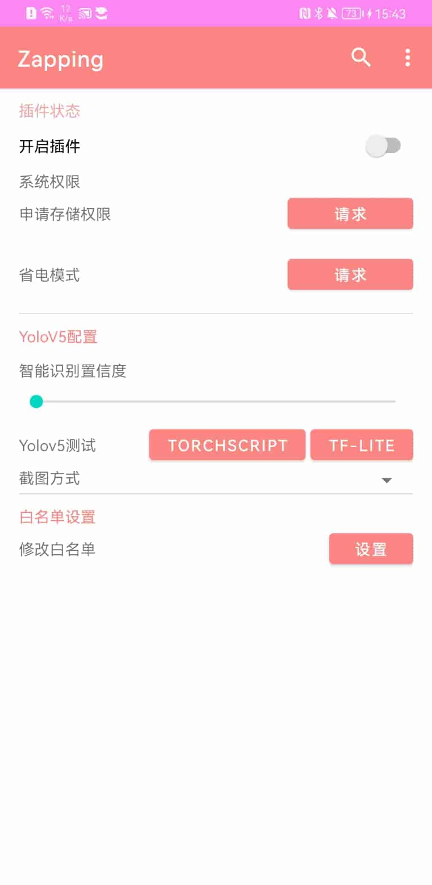
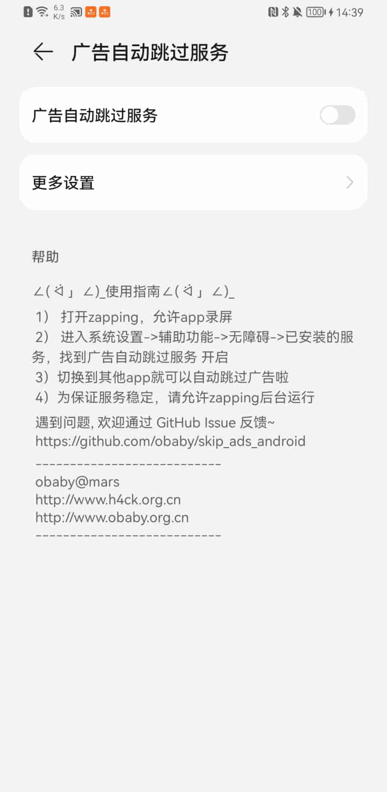
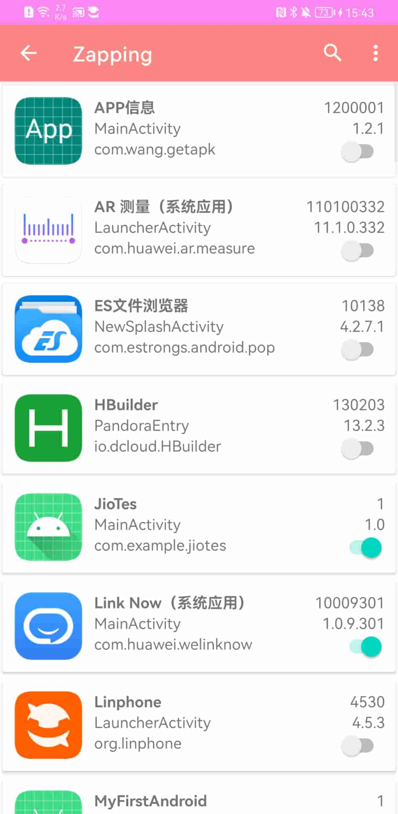
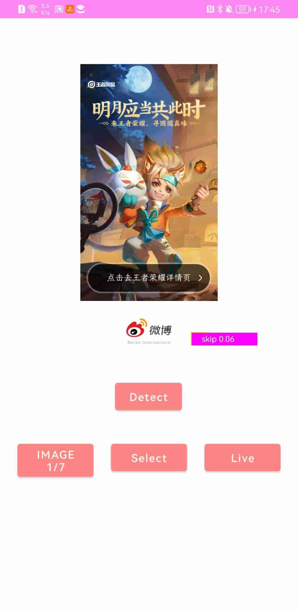

----
Skip Ads Android Project
----
---

##App首页：  
  

##设置页面：
  

##白名单页面：
  

##检测效果（tf-lite）:  
  

##检查效果（torchscript）：  
  

#安卓apk开屏广告跳过按钮识别项目  
作为安卓自动跳过广告三部曲的第二部分，主要是实现系统截屏功能。继《Android Skip Ads Yolov5 Project》之后，下一步就是获取当前屏幕的截图，把截图传入分析引擎实现广告跳过按钮的识别，最后一步是按钮点击。本项目就是最后一步对应的安卓工程。  

声明：  
该项目代码，多数出自于github上公开的代码。对于这些代码直接进行了应用修改，并不是所有代码都是我自己写的。参考的代码主要来源雨参考连接的相关内容，包括但不限于这些链接。感谢各位的开源代码！！  

相关文章：  
[http://h4ck.org.cn/2021/09/android-skip-ads-android-project/](http://h4ck.org.cn/2021/09/android-skip-ads-android-project/)  
[http://h4ck.org.cn/2021/09/yolov5-android-tf-lite%e6%96%b9%e5%bc%8f%e9%9b%86%e6%88%90/](http://h4ck.org.cn/2021/09/yolov5-android-tf-lite%e6%96%b9%e5%bc%8f%e9%9b%86%e6%88%90/)  
[http://h4ck.org.cn/2021/09/yolov5-android-torchscript%e6%96%b9%e5%bc%8f%e9%9b%86%e6%88%90/](http://h4ck.org.cn/2021/09/yolov5-android-torchscript%e6%96%b9%e5%bc%8f%e9%9b%86%e6%88%90/)  
[http://h4ck.org.cn/2021/09/android-skip-ads-yolov5-project/](http://h4ck.org.cn/2021/09/android-skip-ads-yolov5-project/)  

本项目地址：  
[https://github.com/obaby/skip_ads_android](https://github.com/obaby/skip_ads_android)

---
obaby@mars  
http://www.h4ck.org.cn  
http://www.obaby.org.cn

---
参考链接：  
https://github.com/EvgenMeshkin/ScreenShot/blob/master/app/src/main/java/by/android/evgen/screenshot/ScreenActivity.java  
https://blog.csdn.net/qq_38499859/article/details/90523283  
https://juejin.cn/post/6844903589127651335  
https://stackoverflow.com/questions/2661536/how-to-programmatically-take-a-screenshot-on-android  
https://pytorch.org  
https://developer.nvidia.com/cuda-downloads?target_os=Windows&target_arch=x86_64&target_version=10&target_type=exe_network  

https://github.com/goodbranch/ScreenCapture
https://github.com/tyhjh/ScreenShot
https://www.jianshu.com/p/8a428fb45098
https://github.com/BruceWind/AndroidScreenShot_SysApi
https://www.jianshu.com/p/4ae89e1fb36a  

反射截屏：  
http://www.wanyor.com/2018/03/12/115.html  
https://my.oschina.net/asf/blog/4632332

部分代码引用自(感谢作者 LnJan)：  
https://github.com/LnJan/WechatLuckyMoneyGetter/  

https://github.com/DefTruth/lite.ai.toolkit/blob/main/docs/ort/ort_yolov5.zh.md  
https://blog.csdn.net/santanan/article/details/113686650  
https://zhuanlan.zhihu.com/p/361782496  

https://pytorch.org/tutorials/recipes/mobile_interpreter.html  

ncnn模式：  
https://blog.csdn.net/liang_xiao_yun/article/details/112324991  
https://blog.csdn.net/qq_37874136/article/details/111361999  
https://zhuanlan.zhihu.com/p/275989233  
https://blog.csdn.net/weixin_46502301/article/details/118395689  
https://github.com/Tencent/ncnn/releases  

获取安装app列表：
https://github.com/PavitraSahu/GetAppList.git
