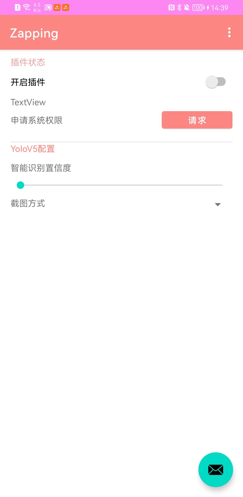
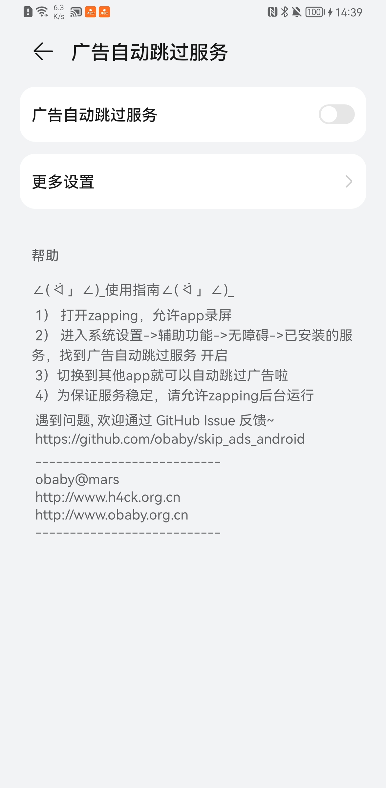

----
Skip Ads Android Project
----
---

  
  

安卓apk开屏广告跳过按钮识别项目

---
obaby@mars  
http://www.h4ck.org.cn  
http://www.obaby.org.cn

参考链接：  
https://github.com/EvgenMeshkin/ScreenShot/blob/master/app/src/main/java/by/android/evgen/screenshot/ScreenActivity.java  
https://blog.csdn.net/qq_38499859/article/details/90523283  
https://juejin.cn/post/6844903589127651335  
https://stackoverflow.com/questions/2661536/how-to-programmatically-take-a-screenshot-on-android  
https://pytorch.org  
https://developer.nvidia.com/cuda-downloads?target_os=Windows&target_arch=x86_64&target_version=10&target_type=exe_network  

https://github.com/goodbranch/ScreenCapture
https://github.com/tyhjh/ScreenShot
https://www.jianshu.com/p/8a428fb45098
https://github.com/BruceWind/AndroidScreenShot_SysApi
https://www.jianshu.com/p/4ae89e1fb36a  

部分代码引用自(感谢作者 LnJan)：  
https://github.com/LnJan/WechatLuckyMoneyGetter/  